# Bakımnerde Kullanım Rehberi

> Son doğrulama: 30 Temmuz 2026  
> Kapsam: Bakımnerde Yönetim Merkezi, şirket yönetim ekranları, taşeron self-servis başvurusu ve Saha uygulaması  
> Görseller: Yerel demo ortamında çalışan gerçek arayüzden alınmıştır. Görsellerdeki iş, bakiye ve kullanıcı değerleri demo verisidir.

## İçindekiler

1. [Sisteme genel bakış](#1-sisteme-genel-bakış)
2. [Giriş adresleri ve demo hesapları](#2-giriş-adresleri-ve-demo-hesapları)
3. [Roller ve yetki matrisi](#3-roller-ve-yetki-matrisi)
4. [Ortak arayüz davranışları](#4-ortak-arayüz-davranışları)
5. [Bakımnerde platform rolleri](#5-bakımnerde-platform-rolleri)
6. [CPO rolleri](#6-cpo-rolleri)
7. [Taşeron yönetim rolleri](#7-taşeron-yönetim-rolleri)
8. [Saha personeli](#8-saha-personeli)
9. [Public taşeron başvurusu](#9-public-taşeron-başvurusu)
10. [Roller arası uçtan uca iş akışı](#10-roller-arası-uçtan-uca-iş-akışı)
11. [Kullanım senaryoları](#11-kullanım-senaryoları)
12. [Durumlar, görünürlük ve iş kuralları](#12-durumlar-görünürlük-ve-iş-kuralları)
13. [Operasyon kontrol listeleri](#13-operasyon-kontrol-listeleri)

---

## 1. Sisteme genel bakış

Bakımnerde; CPO şirketinin bakım talebi oluşturduğu, Bakımnerde operasyonunun işi fiyatlandırıp taşerona atadığı, taşeron yönetiminin randevu ve saha personeli planladığı, saha personelinin bakım kanıtlarını topladığı ve tamamlanan işin onay–hakediş–kapanış adımlarından geçtiği ortak bir operasyon sistemidir.

Sistem dört bakış açısından çalışır:

- **Bakımnerde platformu:** Tüm şirketleri, işleri, iki taraflı fiyatları, cüzdanları ve denetim kayıtlarını yönetir.
- **CPO şirketi:** Kendi cihaz/istasyonları için iş açar, süreci izler, kendisine gösterilen satış fiyatını görür ve son CPO onayını verir.
- **Taşeron şirketi:** Kendisine atanan işi kabul eder, randevuyu onaylar, saha personeli atar, saha kanıtlarını izler ve ek tedarik talebi açar.
- **Saha personeli:** Yalnız kendisine atanmış görevleri mobil uygulamada görür; güvenlik kontrollerini, işlem formunu, fotoğraf kanıtlarını ve gerekli ek tedarik bildirimini tamamlar.

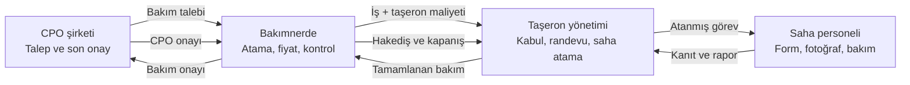
```mermaid
flowchart LR
    CPO["CPO şirketi\nTalep ve son onay"] -->|"Bakım talebi"| PLATFORM["Bakımnerde\nAtama, fiyat, kontrol"]
    PLATFORM -->|"İş + taşeron maliyeti"| CONTRACTOR["Taşeron yönetimi\nKabul, randevu, saha atama"]
    CONTRACTOR -->|"Atanmış görev"| FIELD["Saha personeli\nForm, fotoğraf, bakım"]
    FIELD -->|"Kanıt ve rapor"| CONTRACTOR
    CONTRACTOR -->|"Tamamlanan bakım"| PLATFORM
    PLATFORM -->|"Bakım onayı"| CPO
    CPO -->|"CPO onayı"| PLATFORM
    PLATFORM -->|"Hakediş ve kapanış"| CONTRACTOR
```

## 2. Giriş adresleri ve demo hesapları

### 2.1 Şirket girişi

Adres: `http://127.0.0.1:4173/login`

Bu ekran CPO ve taşeron yönetim hesapları içindir. Üstteki **CPO firma** veya **Taşeron yönetimi** seçimi demo hesabını hızlıca doldurur.

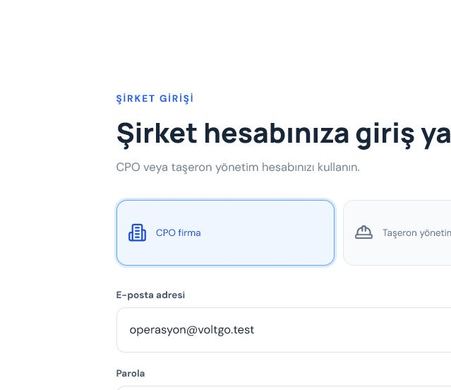

### 2.2 Bakımnerde yetkili girişi

Adres: `http://127.0.0.1:4173/auth/admin/login`

Bu adres yalnız Bakımnerde merkez hesapları içindir; şirket hesapları burada oturum açamaz.

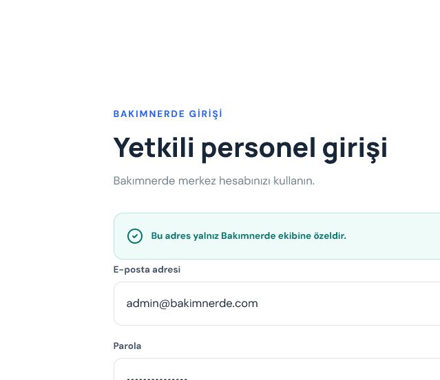

### 2.3 Saha personeli girişi

Yerel web doğrulama adresi: `http://127.0.0.1:4175/login`  
Üretim kullanım kanalı: Bakımnerde Saha mobil uygulaması.

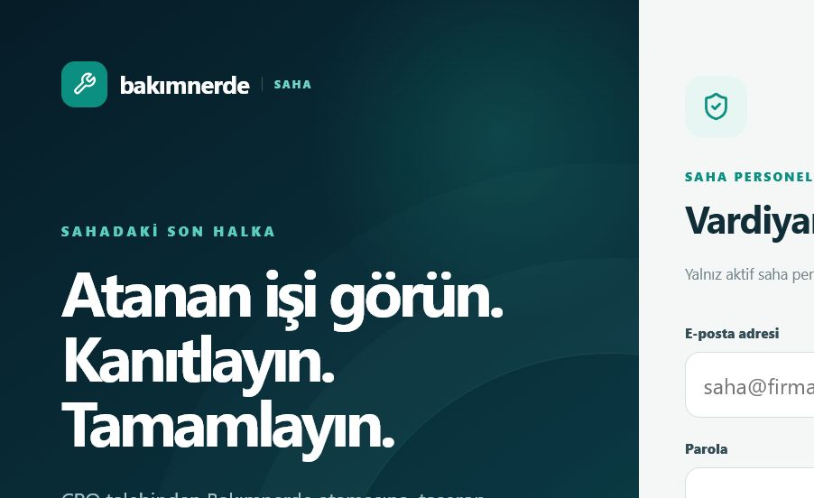

### 2.4 Yerel demo hesapları

| Rol | E-posta | Ortak demo parolası | Kanal |
|---|---|---|---|
| Platform ana hesap | `admin@bakimnerde.com` | `Bakimnerde!2026` | Platform web |
| Platform personeli | `personel@bakimnerde.com` | `Bakimnerde!2026` | Platform web |
| CPO yöneticisi | `operasyon@wattarya.test` | `Bakimnerde!2026` | Şirket web |
| CPO personeli | `personel@wattarya.test` | `Bakimnerde!2026` | Şirket web |
| Taşeron yöneticisi | `yonetici@wattaryateknik.test` | `Bakimnerde!2026` | Şirket web |
| Taşeron operasyon | `operasyon@wattaryateknik.test` | `Bakimnerde!2026` | Şirket web |
| Saha personeli | `saha@wattaryateknik.test` | `Bakimnerde!2026` | Saha mobil |

> Bu bilgiler yalnız yerel/demo ortamı içindir. Üretim parolaları dokümana yazılmamalı ve demo parolası üretimde kullanılmamalıdır.

## 3. Roller ve yetki matrisi

| Ekran / aksiyon | Platform Owner | Platform Staff | CPO Admin | CPO Staff | Taşeron Admin | Taşeron Staff | Field Worker |
|---|:---:|:---:|:---:|:---:|:---:|:---:|:---:|
| Genel bakış | ✓ | ✓ | ✓ | ✓ | ✓ | ✓ | Mobil özet |
| İşleri görüntüleme | Tümü | Tümü | Kendi CPO işleri | Kendi CPO işleri | Kendi taşeron işleri | Kendi taşeron işleri | Yalnız atanan işler |
| Yeni bakım talebi | ✓ | ✓ | ✓ | ✓ | — | — | — |
| Taşeron/fiyat atama | ✓ | ✓ | — | — | — | — | — |
| Randevu kabulü | Görür | Görür | Görür | Görür | ✓ | ✓ | — |
| Saha personeli atama | ✓ | ✓ | — | — | ✓ | ✓ | — |
| Bakıma başlama | — | — | — | — | — | — | ✓ |
| Saha formu/fotoğraf yükleme | İzler | İzler | İzler | İzler | İzler | İzler | ✓ |
| Ek tedarik talebi açma | İzler | İzler | Fiyatlandıktan sonra görür | Fiyatlandıktan sonra görür | ✓ | ✓ | ✓ |
| Ek tedarik fiyatlandırma | ✓ | ✓ | — | — | — | — | — |
| Kesin tedarik tarihi | Görür | Görür | ✓ | ✓ | Görür | Görür | Görür |
| Bakımnerde bakım onayı | ✓ | ✓ | — | — | — | — | — |
| CPO son onayı | — | — | ✓ | ✓ | — | — | — |
| Hakediş/ödeme/kapanış | ✓ | ✓ | İzler | İzler | İzler | İzler | — |
| Cihaz ve istasyon geçmişi | Tümü | Tümü | Kendi varlıkları | Kendi varlıkları | — | — | Görev içindeki varlık |
| Kullanıcı yönetimi | Tüm kategoriler | Tüm kategoriler | Kendi CPO kullanıcıları | — | Kendi taşeron+saha kullanıcıları | — | — |
| Firma yönetimi | ✓ | ✓ | — | — | — | — | — |
| Fiyat yönetimi | ✓ | ✓ | Yalnız işteki satış fiyatı | Yalnız işteki satış fiyatı | Yalnız işteki maliyet | Yalnız işteki maliyet | Fiyat görmez |
| Cüzdan | Tüm firmalar + işlem | Tüm firmalar + işlem | Kendi cüzdanı | Kendi cüzdanı | Kendi cüzdanı | Kendi cüzdanı | — |
| Denetim kayıtları | ✓ | ✓ | — | — | — | — | — |
| İş sohbeti | ✓ | ✓ | — | — | ✓ | ✓ | ✓ |

### Rol ayrımının önemli sonuçları

- `PLATFORM_OWNER` hesabı silinemez, askıya alınamaz ve rolü düşürülemez.
- CPO ve taşeron **staff** hesapları kullanıcı yönetimi menüsünü görmez; kullanıcı ekleme/düzenleme işlemleri şirket admin rolündedir.
- `FIELD_WORKER` web yönetim paneline alınmaz. Yalnız Saha uygulamasında oturum açabilir.
- Platform tüm firmaları görür. CPO ve taşeron sorguları tenant sınırıyla filtrelenir.
- Saha personeli bir işte yalnız kendi kullanıcı kimliği atanmışsa iş detayına ve kanıt alanlarına erişebilir.

## 4. Ortak arayüz davranışları

### 4.1 Sol menü ve üst bar

- Sol menü role göre otomatik daralır.
- **İşler** rozeti aktif iş sayısını gösterir.
- Üst arama kutusu iş numarası, firma, istasyon veya cihaz ifadesini İşler ekranına taşır.
- Bildirim zili okunmamış sayısını gösterir. Bildirime tıklamak kaydı okunmuş yapar ve ilgili iş listesine götürür.
- Profil düğmesi Hesap ekranını, çıkış simgesi oturum kapatmayı açar.
- Canlı durum, bildirim ve iş sayaçları yaklaşık üç saniyede bir yenilenir.

### 4.2 Genel bakış

Genel bakışın iskeleti tüm web rollerinde aynıdır; dördüncü metrik rolün sorumluluğuna göre değişir.

- Platform: **Hakediş bekleyen**
- CPO: **Onay bekleyen**
- Taşeron: **Atama bekleyen**

Riskli işler iki günden az süre kaldığında uyarı şeridinde görünür. Son işler tablosu aynı kayıtların taraflardaki ortak görünümünü sunar.

### 4.3 İş listesi ve iş detayı

- Filtreler: Tüm işler, Bekleyen, Atanan, İşlemde, Ek tedarik.
- Arama: iş no, cihaz, model, istasyon, firma, il ve ilçe üzerinde çalışır.
- Bir satıra tıklanınca sağdan iş detay çekmecesi açılır.
- Çekmece; durum adımlarını, randevuyu, saha formunu, fotoğraf sayaçlarını, ek tedarikleri ve role açıksa sohbet/aksiyonları gösterir.
- Aynı işte gösterilen **tutar role göre farklı olabilir**: CPO satış fiyatını, taşeron kendi maliyetini, platform her iki fiyatı yönetir.

## 5. Bakımnerde platform rolleri

### 5.1 Genel bakış

Platform kullanıcısı tüm aktif işleri, aksiyon bekleyenleri, tamamlananları ve hakediş bekleyenleri toplu görür.

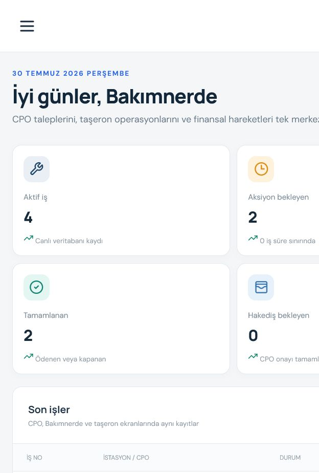

**Temel aksiyonlar**

- Riskli veya son işleri İşler ekranına açmak.
- İş akışındaki güncel adımı izlemek.
- Üst arama ve bildirimlerle ilgili işe gitmek.

**Diğer rollere etkisi:** Platformun atama, onay ve ödeme aksiyonları CPO, taşeron ve saha ekranlarındaki durum/aksiyon alanlarını doğrudan değiştirir.

### 5.2 İş yönetimi

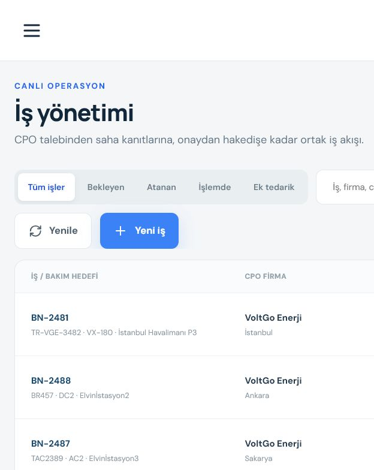

Platform yeni iş oluşturabilir veya CPO'nun açtığı işi **Ata / düzenle** ile tamamlayabilir. Formda CPO, taşeron, istasyon/cihaz, son tarih, randevu, CPO satış fiyatı ve taşeron maliyeti yönetilir.

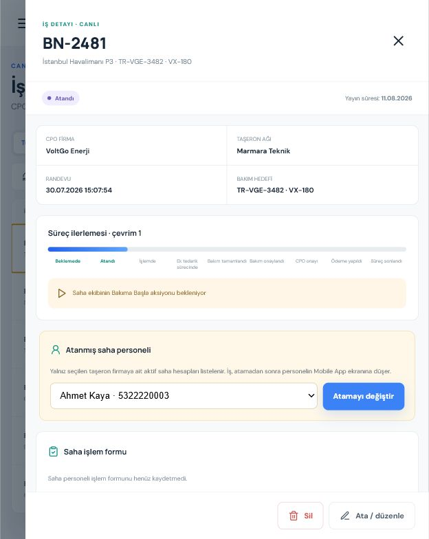

**Platform aksiyonları**

- Yeni iş oluşturmak.
- Bekleyen işe taşeron atamak veya mevcut atamayı/fiyatları düzenlemek.
- Seçilen taşerona ait saha personelini atamak/değiştirmek.
- Saha formu ve 6 önce + 6 sonra + 1 markalı fotoğraf bütünlüğünü izlemek.
- Ek tedarik talebini fiyatlandırıp CPO'ya aktarmak.
- Taşeron yönetimi/saha ile iş sohbeti yürütmek.
- `MAINTENANCE_DONE → MAINTENANCE_APPROVED` geçişinde bakımı onaylamak.
- CPO onayından sonra `CPO_APPROVAL → PAID` ile hakedişi işlemek.
- `PAID → CLOSED` ile süreci kapatmak.
- Yanlış/istenmeyen işi silmek; bu kalıcı bir işlemdir ve onay penceresi gösterilir.

**Diğer rollere etkisi**

- Taşeron atanınca iş taşeron yönetimine görünür.
- Saha personeli atanınca görev ilgili personelin mobil uygulamasına düşer.
- Ek tedarik fiyatlandırılıncaya kadar talep CPO'dan gizlidir.
- Bakım onaylanınca CPO'nun son onay aksiyonu açılır.
- Ödeme işlendiğinde taşeron cüzdan hareketi/hakediş akışı etkilenir.

### 5.3 Cihazlar ve İstasyonlar

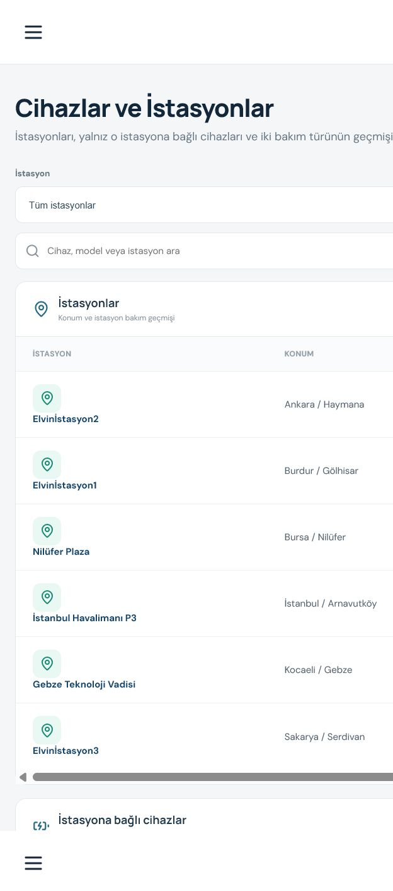

**Aksiyonlar**

- İstasyona göre cihazları filtrelemek.
- Cihaz/model/istasyon aramak.
- İstasyon detayından istasyon altyapısı bakım geçmişini açmak.
- Cihaz detayından yalnız o cihazın bakım geçmişini açmak.

Platform tüm CPO varlıklarını görebilir. Taşeron rolünde bu ekran yoktur.

### 5.4 Kullanıcı yönetimi

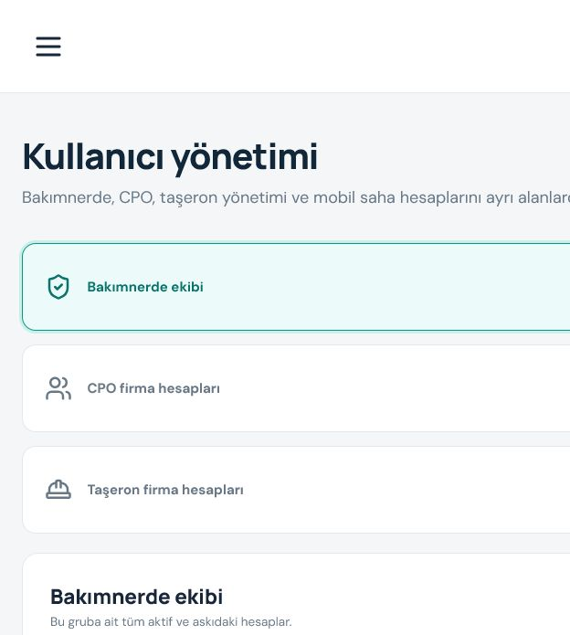

Platform; Bakımnerde, CPO ve taşeron kategorileri arasında geçiş yapabilir.

**Aksiyonlar**

- Firma seçerek kullanıcı oluşturmak.
- Ad, e-posta, telefon, rol, durum ve isteğe bağlı yeni parola düzenlemek.
- Kullanıcıyı aktif/askıda yapmak.
- Korumalı hesaplar hariç kullanıcı silmek.
- Taşeron kategorisinde `FIELD_WORKER` rolü oluşturarak mobil erişim vermek.

**Kurallar**

- Telefon, başında `0` olmadan 10 hane olmalıdır.
- İlk parola en az 8 karakterdir.
- Rol, firmanın tenant türüyle uyumlu olmalıdır.
- Açık oturumdaki kullanıcı kendi hesabını silemez/askıya alamaz.

### 5.5 Taşeron firmalar

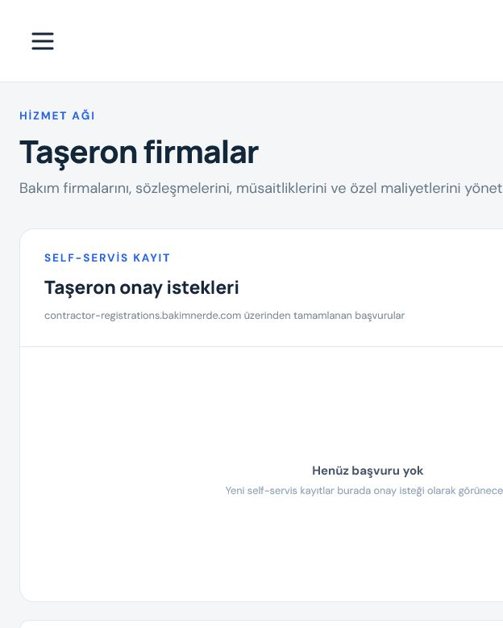

**Aksiyonlar**

- Public formdan gelen bekleyen başvuruyu incelemek.
- Başvuruyu **Kaydı tamamla** ile onaylamak veya neden girerek reddetmek.
- Manuel taşeron firma ve ilk yönetici hesabı oluşturmak.
- Firma iletişimi, konumu, bakım başı maliyet, hizmet bölgeleri ve müsait günleri düzenlemek.
- Online sözleşme durumunu ve dosyasını yönetmek.
- Firma satırına tıklayıp detay çekmecesini açmak.
- Firmayı aktif/askıda yapmak veya onayla kalıcı silmek.

**Diğer rollere etkisi:** Başvuru onaylandığında taşeron tenant'ı ve `CONTRACTOR_ADMIN` hesabı oluşur; şirket girişine ve sonraki iş atamalarına hazır hale gelir.

### 5.6 CPO firmalar

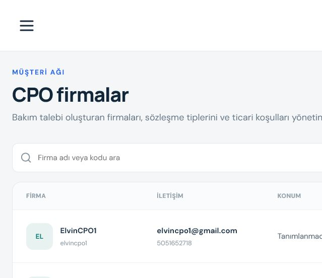

**Aksiyonlar**

- CPO firma ve ilk yönetici hesabı oluşturmak.
- İletişim, konum, anlaşma türü ve istasyon sayısını düzenlemek.
- Firmayı aktif/askıda yapmak, detayını açmak veya silmek.

**Diğer rollere etkisi:** Aktif CPO, şirket girişi yapabilir; kendi varlıklarını ve işlerini görür, yeni bakım talebi oluşturabilir.

### 5.7 Fiyat yönetimi

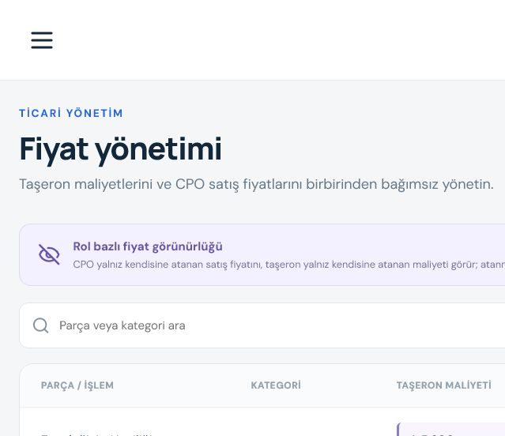

Bu ekran ticari gizliliğin merkezidir.

**Aksiyonlar**

- Periyodik bakım, işçilik, yedek parça ve destek kalemi oluşturmak.
- Taşeron maliyeti ve CPO satış fiyatını ayrı girmek.
- Temin tipini seçmek: merkez stoğu, taşeron temini, CPO temini veya parça hariç.
- Fiyatı belirli CPO/taşeron firmaya bağlamak.
- Kaydı aktif/pasif yapmak, düzenlemek veya silmek.
- Satış fiyatı üzerinden marj yüzdesini izlemek.

**Görünürlük kuralı**

- Platform iki tutarı da görür.
- CPO yalnız kendi işine atanmış satış fiyatını görür.
- Taşeron yalnız kendi işine atanmış maliyeti görür.
- Saha personeli fiyat görmez.

### 5.8 Cüzdan

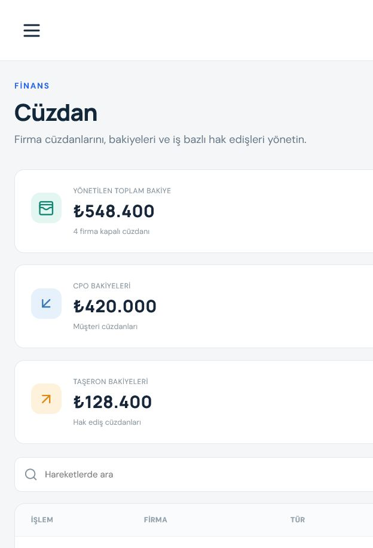

**Aksiyonlar**

- Yönetilen toplam, CPO ve taşeron bakiyelerini ayrı izlemek.
- Firma tipi ve firmayı seçerek bakiye eklemek veya düşmek.
- İşlem türü/açıklaması ve referans girmek.
- Tüm firmaların hareketlerini aramak.

Eksi tutar kesinti/ödeme anlamına gelir; işlem cüzdanı eksi bakiyeye düşüremez. Tüm hareketler kayıt altındadır.

### 5.9 Denetim kayıtları

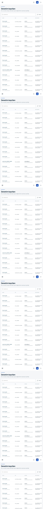

**Aksiyonlar**

- İşlem, rol, kaynak, istek kimliği, IP adresi ve tarih üzerinden kayıtları incelemek.
- Metinle aramak ve listeyi yenilemek.

Bu ekran “kim, ne zaman, hangi veride işlem yaptı?” sorusunun güvenlik cevabıdır; CPO ve taşeron menülerinde bulunmaz.

### 5.10 Hesap

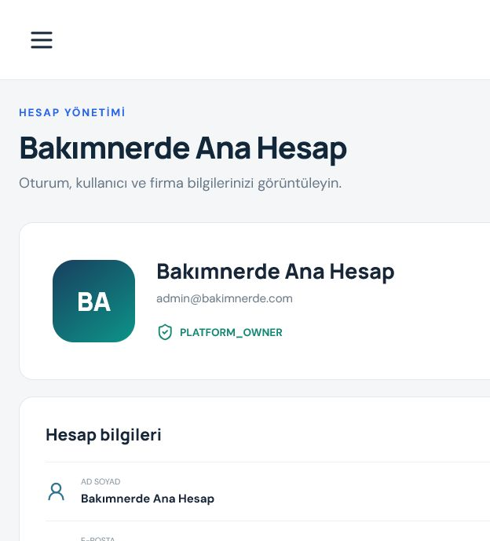

Ad, e-posta, firma, rol ve erişim kanalı görüntülenir. Buradan veya üst bardan oturum kapatılabilir.

## 6. CPO rolleri

### 6.1 Genel bakış

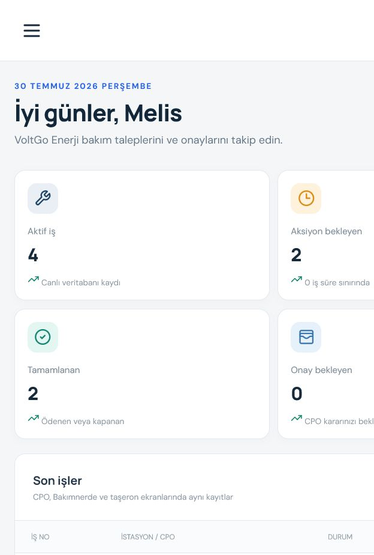

CPO, yalnız kendi tenant'ına bağlı işleri görür. Rol odaklı dördüncü metrik **Onay bekleyen** işlerdir.

### 6.2 İş yönetimi

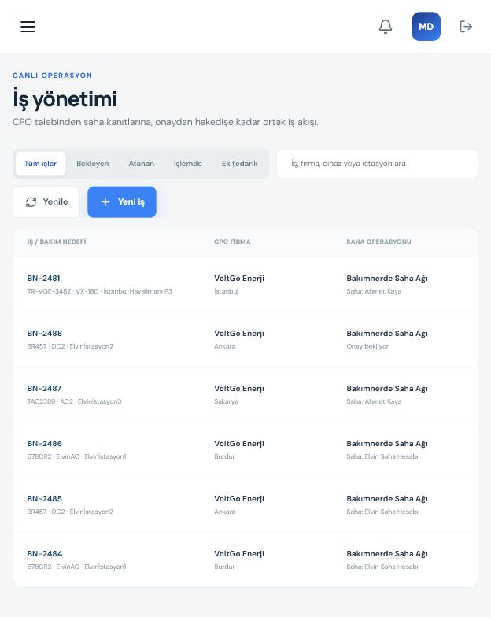

**Yeni bakım talebi**

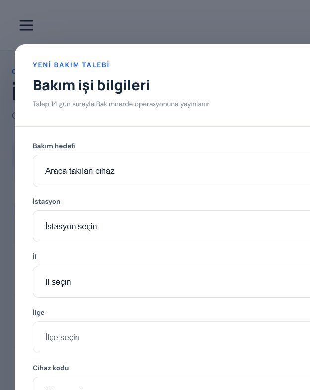

CPO aşağıdaki bilgilerle talep yayınlar:

- Bakım hedefi: araca takılan cihaz veya istasyon/şebeke altyapısı.
- Mevcut ya da yeni istasyon.
- İl/ilçe.
- Cihaz kodu/modeli veya istasyon bakım alanı.
- Son tarih; yayın süresi varsayılan olarak 14 gündür.

CPO formunda taşeron maliyeti ve taşeron seçimi yoktur. Bu ticari/operasyonel eşleştirme Bakımnerde tarafından yapılır.

**İş detayı**

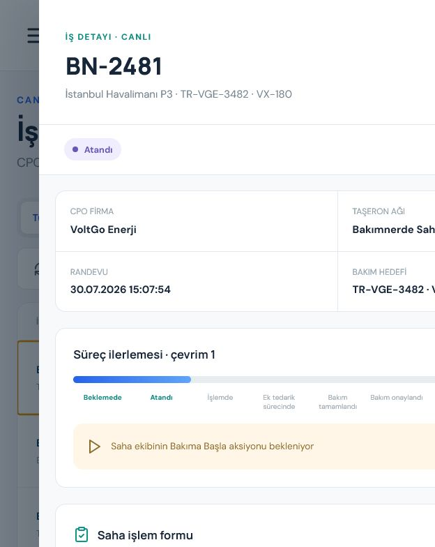

CPO şunları yapabilir:

- Süreç adımlarını, randevuyu, saha formunu ve kanıt sayılarını izlemek.
- Kendisine atanmış satış fiyatını görmek.
- Ek tedarik Bakımnerde tarafından fiyatlandırılıp aktarıldıktan sonra kesin tedarik tarihi bildirmek.
- Tedarik sürecinde gecikme veya temin edildi durumu girmek.
- Bakımnerde onayı sonrasında **Bakımı CPO olarak onayla** aksiyonunu kullanmak.

CPO, saha iş sohbetine erişmez; bu sohbet Bakımnerde ile taşeron/saha arasındadır.

### 6.3 Cihazlar ve İstasyonlar

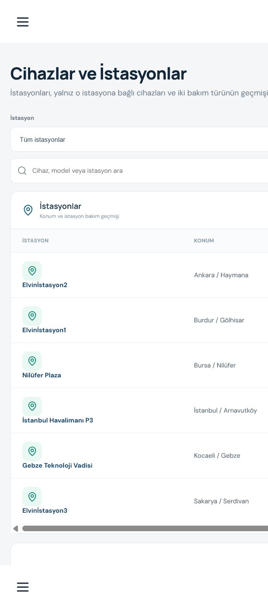

CPO yalnız kendi cihaz/istasyonlarını ve bunlara bağlı bakım geçmişini görüntüler. Başka CPO tenant'ının varlığına erişemez.

### 6.4 Kullanıcı yönetimi

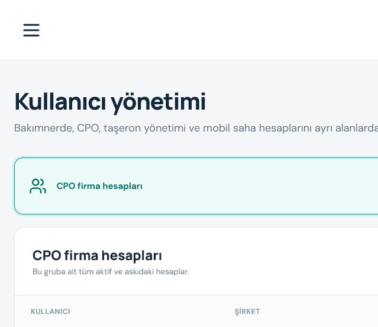

Yalnız `CPO_ADMIN` bu menüyü görür ve kendi firmasına `CPO_ADMIN`/`CPO_STAFF` hesapları ekleyebilir. `CPO_STAFF` menüyü görmez.

### 6.5 Cüzdan

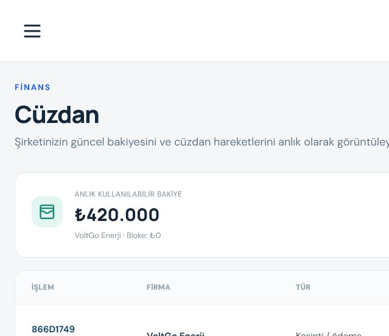

CPO yalnız kendi kullanılabilir/bloke bakiyesini ve kendi hareketlerini görür. Bakiye ekleme/düşme aksiyonu platforma aittir.

### 6.6 Hesap

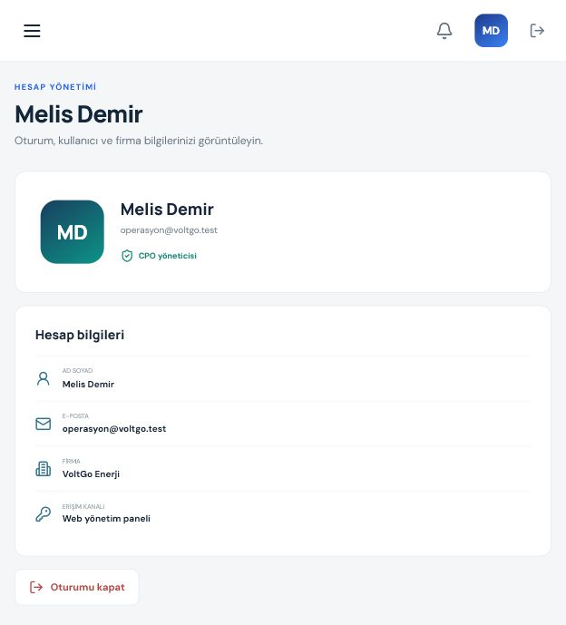

Kullanıcı, rol ve firma özeti gösterilir; hesap yönetimine veya oturum kapatmaya hızlı erişim sağlar.

## 7. Taşeron yönetim rolleri

### 7.1 Genel bakış

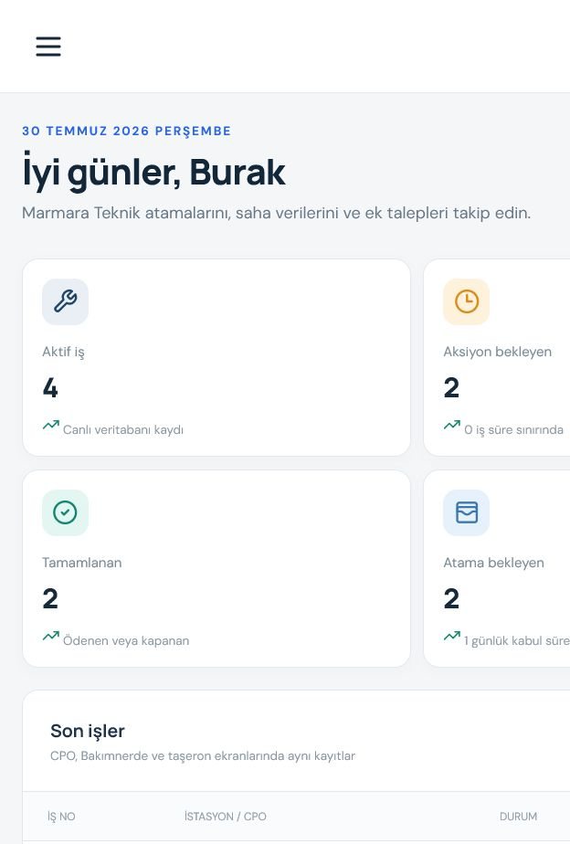

Taşeron yalnız kendisine atanmış işleri görür. Dördüncü metrik **Atama bekleyen** işlerdir ve kabul süresini hatırlatır.

### 7.2 İş yönetimi

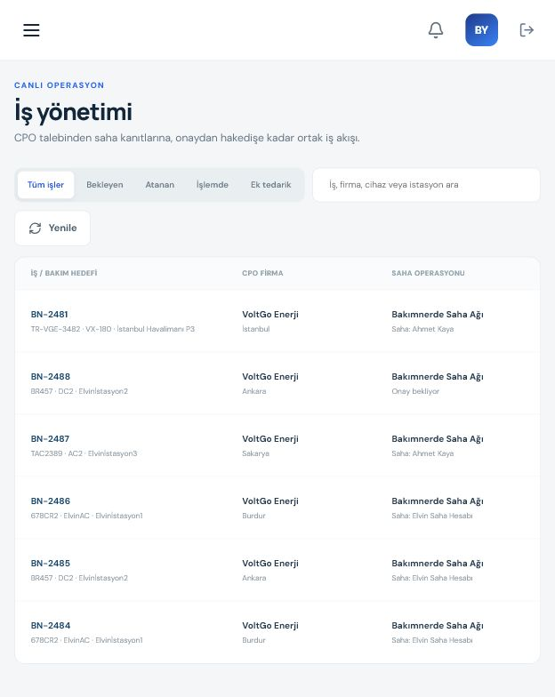

Taşeron yeni iş yayınlayamaz. Listeye iş, Bakımnerde atamasıyla düşer.

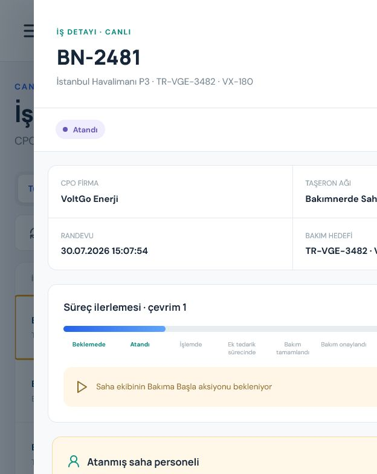

**Taşeron aksiyonları**

- Atamayı randevu tarihiyle kabul etmek.
- Yalnız kendi firmasındaki aktif saha personelini seçmek/değiştirmek.
- Saha formu ve fotoğraf ilerlemesini takip etmek.
- Ek parça/işlem gerektiğinde tedarik türü ve açıklama ile talep oluşturmak.
- Bakımnerde ve saha personeliyle iş sohbeti yürütmek.
- Kendi taşeron maliyetini görmek; CPO satış fiyatını görmemek.

**Diğer rollere etkisi**

- Randevu kabulü işin sahada başlatılabilme koşullarından biridir.
- Saha ataması görevi yalnız seçilen kişinin mobil ekranına düşürür.
- Ek tedarik talebi önce yalnız Bakımnerde'ye gider; fiyatlandıktan sonra CPO'ya açılır.

### 7.3 Kullanıcı yönetimi

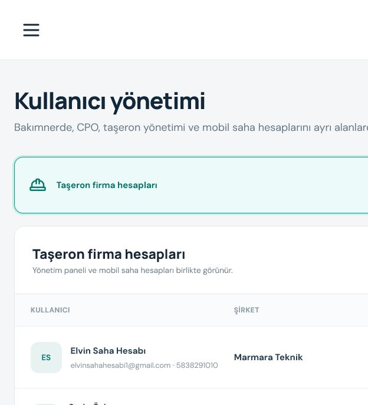

Yalnız `CONTRACTOR_ADMIN` kendi firmasına şu rolleri ekleyebilir:

- Taşeron yöneticisi (`CONTRACTOR_ADMIN`)
- Taşeron operasyon (`CONTRACTOR_STAFF`)
- Saha ekibi (`FIELD_WORKER`, yalnız mobil)

Saha hesabında telefon bilgisi, atama listesinde personeli ayırt etmek için kullanılır.

### 7.4 Cüzdan

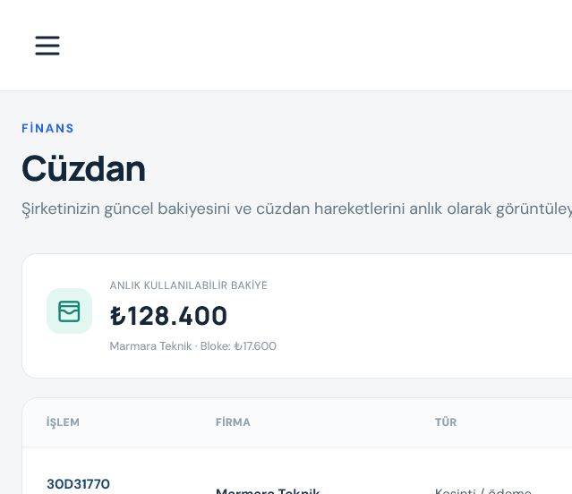

Taşeron kullanılabilir ve bloke bakiyesini, hakediş/ödeme hareketlerini görür. Platformun yaptığı finansal işlem burada anlık görünür.

### 7.5 Hesap

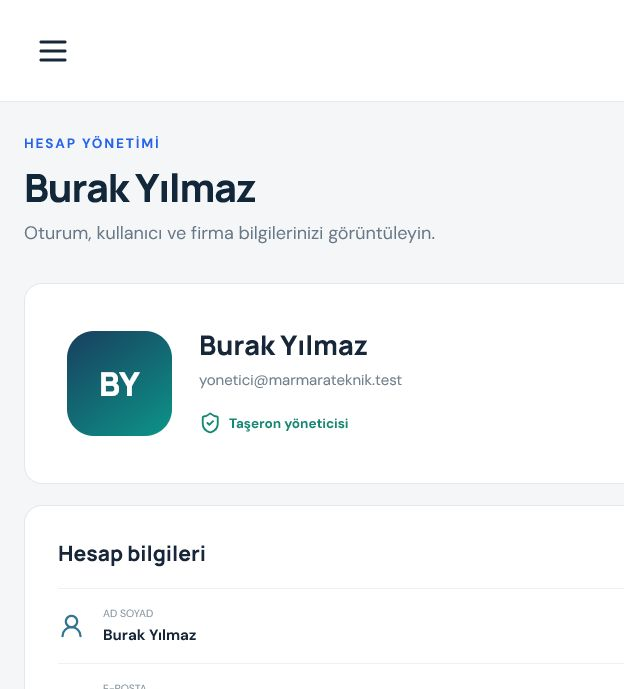

Kullanıcı, rol, firma ve erişim kanalı özetidir.

## 8. Saha personeli

Saha personeli yönetim paneline alınmaz. Tüm işi mobil odaklı Saha uygulamasında yürütür.

### 8.1 Ana sayfa

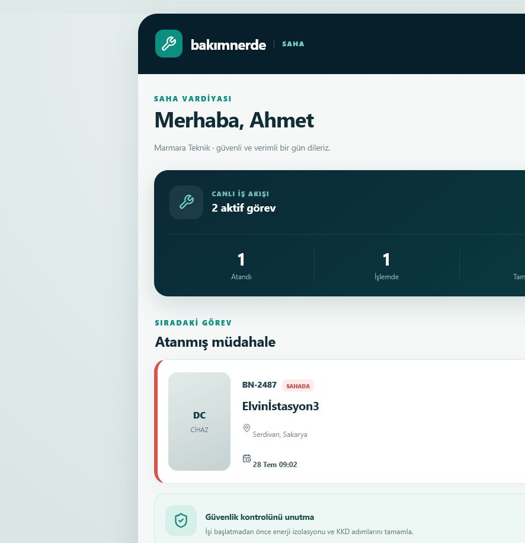

- Aktif, atanmış, işlemde ve tamamlanan görev özetlerini görür.
- Sıradaki göreve ve son görevlere hızlı gider.
- Bildirim ve profil alanına erişir.

### 8.2 Görevlerim

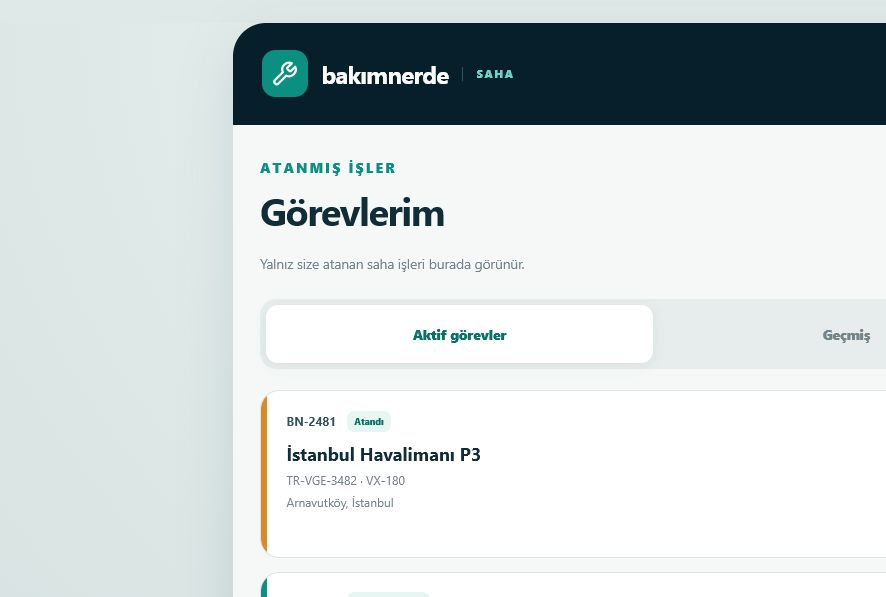

- Yalnız kullanıcıya atanmış işler listelenir.
- Aktif görevler ve geçmiş arasında geçiş yapılır.
- Yenile ile sunucudaki son durum alınır.

### 8.3 Görev detayı ve güvenli başlangıç

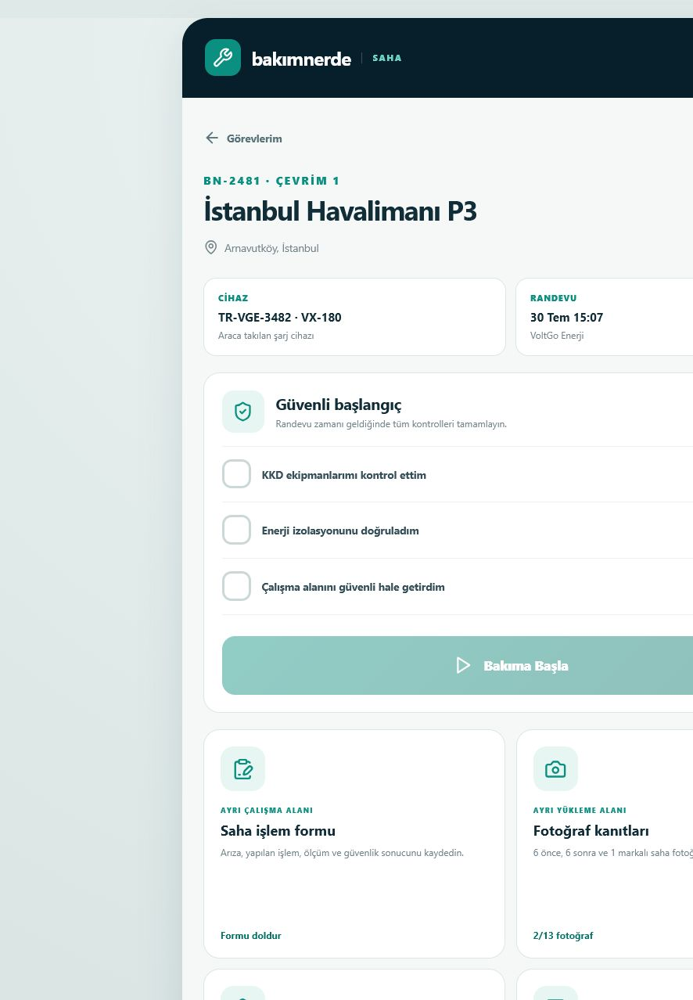

Görev detayında istasyon/konum, cihaz veya istasyon bakım hedefi, randevu ve CPO bilgisi yer alır.

**Bakıma Başla** düğmesi şu koşullarda açılır:

1. Taşeron atamayı kabul etmiş olmalıdır.
2. Randevu zamanı gelmiş olmalıdır.
3. KKD kontrolü, enerji izolasyonu ve çalışma alanı güvenliği kutuları işaretlenmelidir.

Bakıma başlandığında iş `ASSIGNED → IN_PROGRESS` olur ve tüm tarafların ekranı güncellenir.

### 8.4 Saha işlem formu

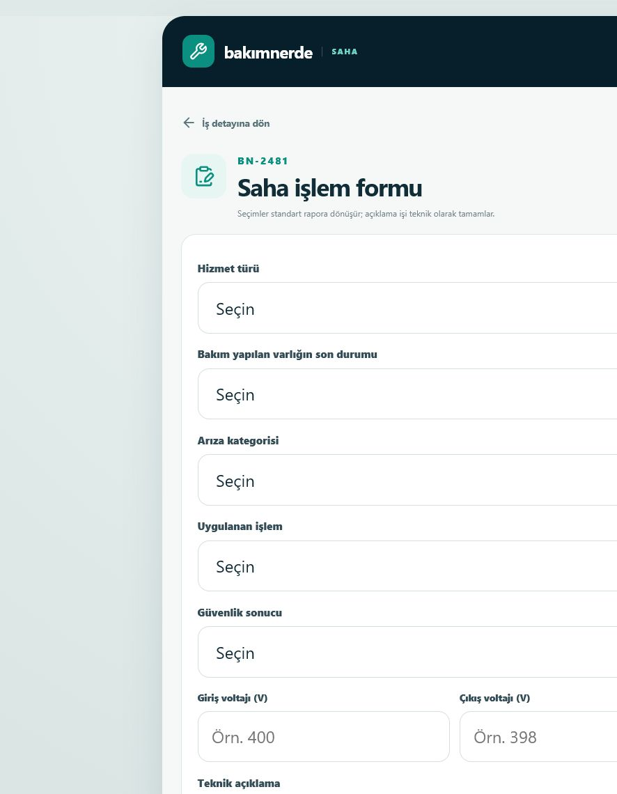

Form; servis türü, ekipman durumu, arıza kategorisi, yapılan işlem, güvenlik sonucu, ölçümler ve teknik notları standardize eder. Yalnız atanmış saha personeli kaydedebilir.

### 8.5 Fotoğraf kanıtları

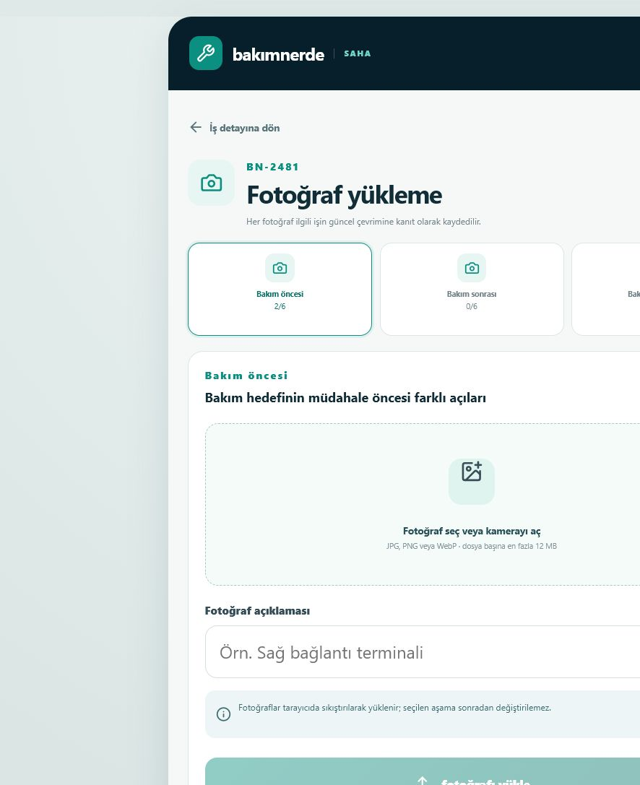

Her iş çevrimi için zorunlu set:

- 6 bakım öncesi fotoğraf
- 6 bakım sonrası fotoğraf
- 1 markalı kıyafet/saha fotoğrafı

JPG, PNG veya WebP kabul edilir; dosya başına üst sınır 12 MB'dir. Kanıtlar iş detayında CPO, taşeron ve platform tarafından izlenebilir.

### 8.6 Ek tedarik

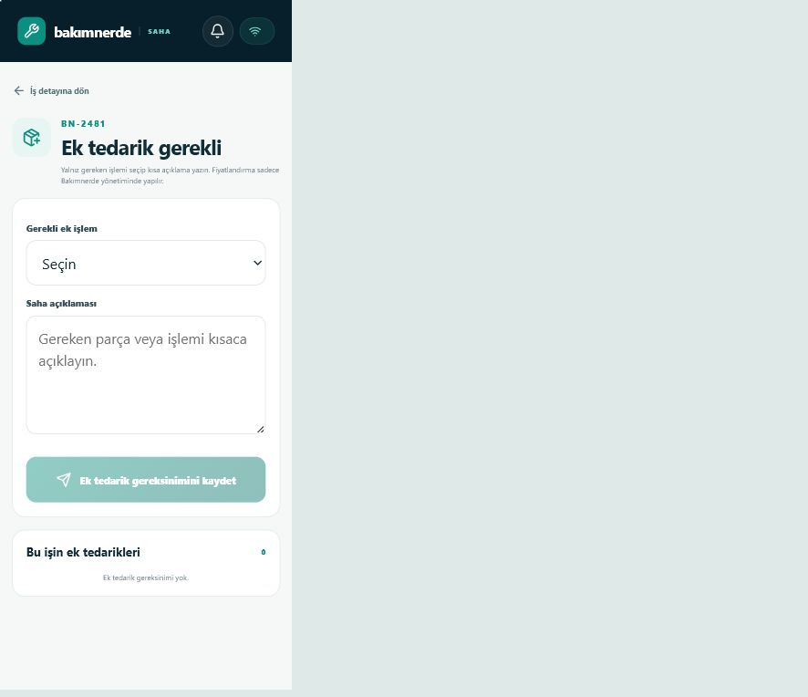

Saha personeli fan, kablo, konnektör veya diğer tedarik türünü seçip açıklama yazar. Talep önce Bakımnerde'ye ulaşır; sahada fiyat bilgisi gösterilmez.

### 8.7 İş sohbeti

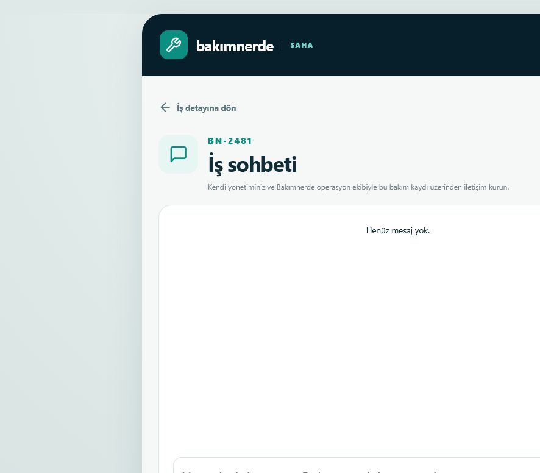

Saha personeli kendi taşeron yönetimi ve Bakımnerde ile mesajlaşır. CPO bu özel operasyon sohbetinin katılımcısı değildir.

### 8.8 Bakımı tamamlama

**Bakımı tamamla ve onaya gönder** düğmesi yalnız şu şartlar birlikte sağlanınca açılır:

- İş `IN_PROGRESS` durumundadır.
- Saha formu tamamlanmıştır.
- Fotoğraf seti eksiksiz 13/13'tür.

Aksiyon işi `MAINTENANCE_DONE` durumuna geçirir ve Bakımnerde onay kuyruğuna taşır.

### 8.9 Profil

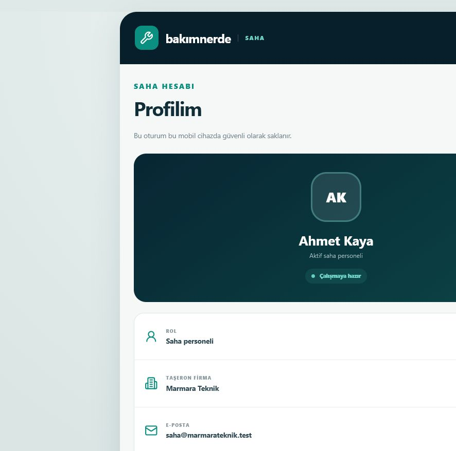

Saha kullanıcısı kendi ad, e-posta, telefon, firma ve erişim kanalını görür; oturumunu kapatabilir.

## 9. Public taşeron başvurusu

Adres: `http://127.0.0.1:4173/contractor-registration`  
Hedef üretim alan adı: `contractor-registrations.bakimnerde.com`

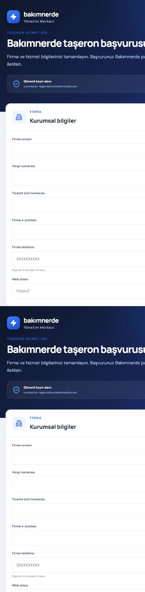

Başvuru sahibi şu bilgileri tamamlar:

- Firma unvanı, vergi ve ticaret sicil numarası
- Firma iletişimi ve web sitesi
- Yetkili kişi, görev, e-posta, telefon ve ilk parola
- İl, ilçe ve açık adres
- Hizmet verilen iller, uzmanlıklar ve müsait günler
- Bakımnerde Taşeronlarla Hizmet Sözleşmesi onayı

Sözleşme onaylanmadan **Başvuruyu onaya gönder** düğmesi açılmaz. Başvuru tamamlandığında doğrudan aktif firma oluşturmaz; Platform > Taşeron firmalar ekranında onay isteği doğurur. Platform reddederse neden kaydedilir; onaylarsa taşeron firma ve ilk yönetici hesabı oluşturulur.

## 10. Roller arası uçtan uca iş akışı

| Adım | Durum | Aksiyonu yapan | Ekran | Sonraki role etkisi |
|---:|---|---|---|---|
| 1 | `WAITING` | CPO veya Platform | İşler > Yeni iş | Talep Bakımnerde operasyonuna düşer |
| 2 | `WAITING` | Platform | Ata / düzenle | Taşeron, maliyet ve gerekirse randevu atanır |
| 3 | `ASSIGNED` | Taşeron yönetimi | İş detayı | Randevu kabul edilir; saha başlatma koşulu hazırlanır |
| 4 | `ASSIGNED` | Taşeron/Platform | İş detayı | Saha personeli atanır; mobil görev oluşur |
| 5 | `IN_PROGRESS` | Saha personeli | Görev detayı | Güvenlik kontrolleri sonrası bakım başlar |
| 6 | `IN_PROGRESS` | Saha personeli | Form/Fotoğraf | Rapor ve 13 kanıt tüm yönetim taraflarında görünür |
| 7 | `ADDITIONAL_SUPPLY` | Saha/Taşeron | Ek tedarik | Talep ilk aşamada yalnız Platforma görünür |
| 8 | `ADDITIONAL_SUPPLY` | Platform | İş detayı | Fiyatlandırılan talep CPO'ya aktarılır |
| 9 | `ADDITIONAL_SUPPLY` | CPO | İş detayı | Kesin tedarik tarihi bildirilir; süreç takip edilir |
| 10 | `MAINTENANCE_DONE` | Saha personeli | Görev detayı | Eksiksiz form+kanıt Bakımnerde onayına gider |
| 11 | `MAINTENANCE_APPROVED` | Platform | İş detayı | CPO son onay düğmesi açılır |
| 12 | `CPO_APPROVAL` | CPO | İş detayı | Platform hakediş/ödeme adımına geçebilir |
| 13 | `PAID` | Platform | İş detayı/Cüzdan | Taşeron finansal hareketi görünür |
| 14 | `CLOSED` | Platform | İş detayı | İş aktif kuyruktan tamamlananlara taşınır |

## 11. Kullanım senaryoları

### Senaryo A — CPO yeni cihaz bakımı ister

1. CPO Admin/Staff şirket girişinden oturum açar.
2. İşler > **Yeni iş** seçilir.
3. Bakım hedefi cihaz, istasyon ve cihaz kodu/modeli seçilir.
4. Talep yayınlanır; iş `WAITING` durumundadır.
5. Platform işi açar, taşeron ile CPO/taşeron fiyatlarını atar.
6. Taşeron randevuyu kabul eder ve saha çalışanı seçer.
7. Saha personeli bakım, form ve fotoğrafları tamamlar.
8. Platform bakım kanıtlarını onaylar.
9. CPO son onayı verir.
10. Platform ödemeyi işler ve işi kapatır.

### Senaryo B — İstasyon/şebeke altyapısı bakımı

1. Yeni iş formunda hedef **İstasyon / şebeke altyapısı** seçilir.
2. Alan olarak genel bileşenler veya bölgesel şebeke bağlantısı belirtilir.
3. İş cihaz koduna değil istasyon bakım geçmişine bağlanır.
4. Platform/CPO, Cihazlar ve İstasyonlar ekranında istasyon detayından bu geçmişi izler.

### Senaryo C — Sahada beklenmeyen parça ihtiyacı

1. Saha personeli veya taşeron yönetimi Ek tedarik alanında tür ve açıklama girer.
2. CPO henüz talebi görmez; Platform fiyatlandırması beklenir.
3. Platform CPO ücretini girip talebi CPO'ya aktarır.
4. CPO kesin tedarik tarihi bildirir.
5. Platform veya CPO gecikme/temin durumunu günceller.
6. `SUPPLIED` sonrasında bakımın devamı izlenir.

### Senaryo D — Yeni taşeronun sisteme katılması

1. Firma public başvuru formunu doldurur ve sözleşmeyi onaylar.
2. Platform Taşeron firmalar ekranındaki bekleyen başvuruyu inceler.
3. Uygun değilse neden yazarak reddeder.
4. Uygunsa **Kaydı tamamla** der; firma ve ilk admin hesabı açılır.
5. Taşeron admin şirket girişinden oturum açar, operasyon ve saha hesaplarını oluşturur.
6. Platform artık yeni işlerde bu taşeronu seçebilir.

### Senaryo E — Personel değişikliği

1. Taşeron Admin, Kullanıcı yönetiminden yeni `FIELD_WORKER` hesabı açar.
2. İş detayında saha personeli seçimini değiştirir.
3. Eski personelin görev erişimi kapanır; yeni personelin Görevlerim listesine iş düşer.
4. Bakım tamamlandıktan sonra saha personeli değiştirilemez.

### Senaryo F — Finansal düzeltme

1. Platform Cüzdan > **Bakiye işlemi** açar.
2. Firma türü, firma, artı/eksi tutar, işlem türü ve referans girilir.
3. İşlem kaydedilir; bakiye eksiye düşecekse sistem reddeder.
4. İlgili CPO/taşeron kendi cüzdan ekranında hareketi görür.
5. Denetim ve operasyon kayıtları olay araştırmasında referans sağlar.

## 12. Durumlar, görünürlük ve iş kuralları

### 12.1 İş durumları

| Teknik durum | Kullanıcı etiketi | Ana sorumlu |
|---|---|---|
| `WAITING` | Beklemede | Platform ataması |
| `ASSIGNED` | Atandı | Taşeron kabulü / saha ataması |
| `IN_PROGRESS` | İşlemde | Saha personeli |
| `ADDITIONAL_SUPPLY` | Ek tedarik sürecinde | Saha → Platform → CPO |
| `MAINTENANCE_DONE` | Bakım tamamlandı | Platform bakım onayı |
| `MAINTENANCE_APPROVED` | Bakım onaylandı | CPO son onayı |
| `CPO_APPROVAL` | CPO onayı | Platform hakediş/ödeme |
| `PAID` | Ödeme yapıldı | Platform kapanışı |
| `CLOSED` | Süreç sonlandı | Tamamlandı |

### 12.2 Ek tedarik durumları

| Teknik durum | Anlamı | Görünür/aksiyon sahibi |
|---|---|---|
| `PENDING_PRICING` | Bakımnerde fiyatlandırması bekleniyor | Platform; CPO'dan gizli |
| `AWAITING_CPO_DEADLINE` | CPO kesin tarih girecek | CPO |
| `SUPPLY_IN_PROGRESS` | Tedarik sürüyor | Platform ve CPO izler/günceller |
| `DELAYED` | Gecikme bildirildi | Platform/CPO |
| `SUPPLIED` | Temin edildi | Tüm ilgili taraflarda sonuç görünür |

### 12.3 Veri gizliliği

- Tenant filtresi API katmanında uygulanır; yalnız menü gizlemeye güvenilmez.
- CPO başka CPO'nun işini, cihazını, istasyonunu, kullanıcılarını veya cüzdanını göremez.
- Taşeron başka taşeronun işini, saha personelini, kullanıcılarını veya cüzdanını göremez.
- Field Worker yalnız kendisine atanmış işe erişebilir.
- CPO satış fiyatı ile taşeron maliyeti ayrıdır.
- CPO iş sohbetine dahil değildir; saha operasyon konuşması Bakımnerde–taşeron–atanmış saha personeli arasındadır.

### 12.4 Silme ve koruma kuralları

- Firma, kullanıcı, fiyat ve iş silme eylemleri geri alınamaz kabul edilmelidir; arayüz onay ister.
- Platform ana hesabı korunur.
- Kullanıcı kendi açık hesabını silemez veya askıya alamaz.
- Bakım tamamlandıktan sonra saha personeli ataması kilitlenir.
- Cüzdan işlemi bakiyeyi sıfırın altına indiremez.

## 13. Operasyon kontrol listeleri

### CPO talep yayınlamadan önce

- [ ] Doğru bakım hedefi seçildi.
- [ ] İstasyon, il/ilçe ve cihaz bilgisi doğrulandı.
- [ ] Son tarih gerçekçi belirlendi.
- [ ] Talebin Bakımnerde atamasına gönderileceği biliniyor.

### Platform işe atama yapmadan önce

- [ ] CPO ve varlık bilgileri doğrulandı.
- [ ] Taşeronun hizmet bölgesi ve müsaitliği uygun.
- [ ] CPO satış fiyatı ve taşeron maliyeti doğru ve birbirinden ayrılmış.
- [ ] Randevu/son tarih uyumlu.

### Taşeron sahaya göndermeden önce

- [ ] Atama randevuyla kabul edildi.
- [ ] Aktif ve doğru saha personeli seçildi.
- [ ] Personelin telefon/hesap bilgisi güncel.
- [ ] İş hedefi ve saha güvenliği bilgisi personele ulaştı.

### Saha personeli işi tamamlamadan önce

- [ ] KKD, enerji izolasyonu ve alan güvenliği kontrolleri tamamlandı.
- [ ] Saha işlem formu eksiksiz kaydedildi.
- [ ] 6 önce + 6 sonra + 1 markalı fotoğraf yüklendi.
- [ ] Ek tedarik gerekiyorsa tür ve açıklama girildi.
- [ ] İş sohbetindeki açık konular kontrol edildi.

### Platform işi kapatmadan önce

- [ ] Saha formu ve 13 fotoğraf incelendi.
- [ ] Ek tedarik kayıtları sonuçlandı.
- [ ] Bakımnerde onayı verildi.
- [ ] CPO onayı alındı.
- [ ] Hakediş/cüzdan hareketi doğrulandı.
- [ ] İş `CLOSED` durumuna geçirildi.

---

Bu rehberdeki ekran görüntüleri, rol görünürlükleri ve aksiyonlar 30 Temmuz 2026 tarihli yerel demo verisi ve çalışan uygulama davranışıyla doğrulanmıştır.
